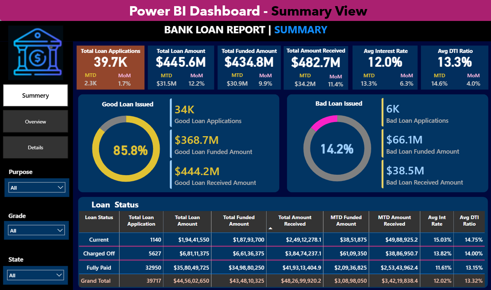
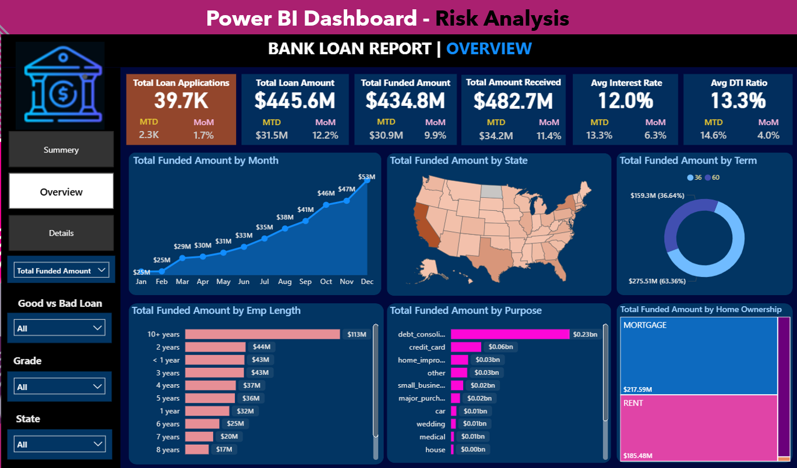
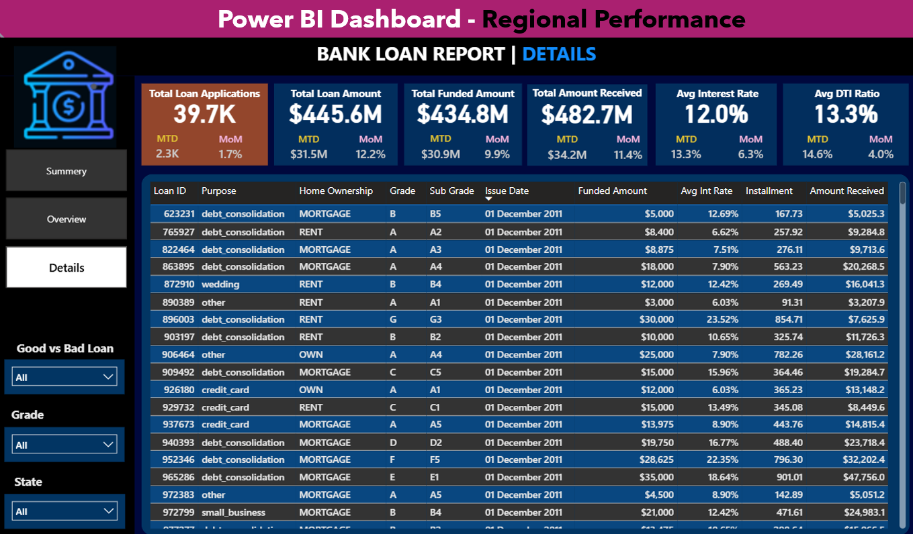
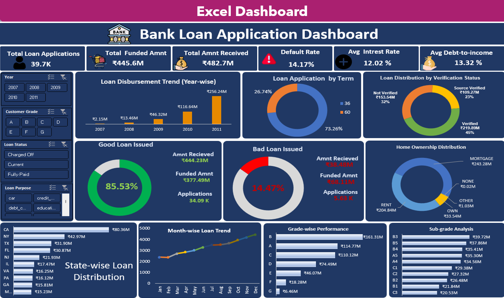
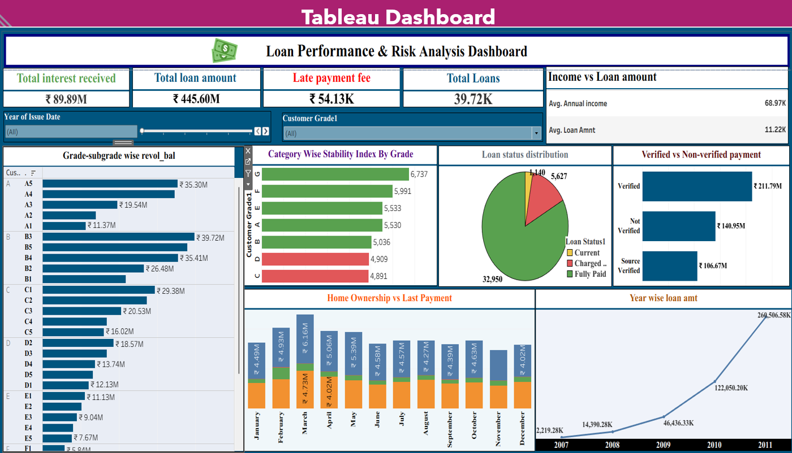

# Bank Loan Analytics

## 📌 Project Overview

This Bank Loan Analytics project focuses on analyzing lending activities, loan portfolio performance, customer repayment behavior, credit risk, and regional loan trends.

The project was developed as part of my Business Analyst internship using Excel, SQL, Power BI, and Tableau to transform loan data into meaningful business insights and support data-driven decision-making.

## 🎯 Project Objectives

- Monitor and evaluate lending activities
- Analyze loan portfolio performance
- Identify good and bad loan segments
- Understand customer repayment behavior
- Analyze credit risk using loan grades and sub-grades
- Identify regional and seasonal loan trends
- Analyze customer verification and home ownership patterns
- Generate business recommendations for better lending decisions

## 📊 Key Portfolio Metrics

| Metric | Value |
|---|---:|
| Total Loan Applications | 39,717 |
| Total Loan Amount | $445.6M |
| Total Funded Amount | $434.8M |
| Good Loan | 85.8% |
| Bad Loan | 14.2% |

## 📈 Key Analysis

### 1. Year-wise Loan Amount Analysis

Analyzed loan amount trends across different years to understand changes in loan demand and portfolio growth.

**Key Insight:**
- Loan amounts show an increasing trend over the analyzed period.
- Higher growth was observed during the later years of the analysis.

**Business Recommendation:**
- Increase loan approval capacity during high-demand periods.
- Strengthen credit risk assessment to manage portfolio risk.
- Use historical demand trends for better business planning.

### 2. Grade & Sub-grade vs. Revolving Balance

Analyzed revolving balances across different loan grades and sub-grades to identify higher-risk customer segments.

**Key Insight:**
- Lower loan grades generally show higher revolving balances.
- Higher loan grades generally demonstrate comparatively lower debt levels.

**Business Recommendation:**
- Apply stronger credit-risk controls to higher-risk segments.
- Use risk-based lending strategies.
- Monitor customers with higher revolving balances.

### 3. Verified vs. Non-Verified Payment Analysis

Compared payment behavior between verified and non-verified customers.

**Key Insight:**
- Verified customers contribute a significant portion of total payments.
- Verification status provides useful information for evaluating repayment behavior.

**Business Recommendation:**
- Strengthen KYC and document verification processes.
- Encourage verification before loan approval.
- Consider verification status along with other credit indicators.

### 4. State-wise & Month-wise Loan Analysis

Analyzed loan activity across different states and months to identify regional and seasonal patterns.

**Key Insight:**
- Loan activity varies across different states.
- Monthly trends provide useful information about changes in loan demand.

**Business Recommendation:**
- Focus business expansion on high-performing regions.
- Monitor risk in regions with weaker loan performance.
- Consider seasonal demand while planning resources and campaigns.

### 5. Home Ownership & Repayment Behaviour

Analyzed customer repayment behavior based on home ownership status.

**Key Insight:**
- Home ownership provides an additional factor for understanding customer financial characteristics.
- Repayment behavior varies across different home ownership categories.

**Business Recommendation:**
- Include home ownership as one factor in customer risk assessment.
- Combine it with other financial and credit indicators.
- Design suitable lending strategies for different customer segments.

## 📊 Dashboard Preview

### Power BI — Summary View

### Power BI — Risk Analysis

### Power BI — Regional Performance

### Excel Dashboard

### Tableau Dashboard

## 🛠️ Tools & Technologies

- Microsoft Excel
- SQL
- Power BI
- Tableau
- Data Analysis
- Data Visualization
- Dashboard Development
- KPI Analysis
- Business Reporting

## 📁 Project Files

| File | Description |
|---|---|
| `Bank_Loan_Excel_Dashboard.xlsx` | Excel dashboard |
| `Bank_Loan_KPI_Querries.sql` | SQL queries used for KPI analysis |
| `Bank_Loan_PowerBI_Dashboard.pbix` | Power BI dashboard |
| `Bank_Loan_Tableau_Dashboard.twbx` | Tableau dashboard |
| `Bank_Loan_Tableau_Story.twbx` | Tableau story |
| `Bank_Loan_Presentation.pptx` | Project presentation |

## 💡 Business Recommendations

Based on the analysis:

- Improve credit risk assessment before loan approval.
- Monitor good-loan and bad-loan segments regularly.
- Strengthen customer verification and KYC processes.
- Apply stronger controls to higher-risk loan grades.
- Use regional performance for better business planning.
- Consider seasonal loan demand when planning campaigns.
- Combine customer demographics, repayment behavior, and credit characteristics when evaluating customers.
- Develop lending strategies according to customer risk profiles.

## 👨‍💻 Skills Demonstrated

- Business Analysis
- Data Analysis
- SQL
- Data Cleaning
- KPI Development
- Power BI
- Microsoft Excel
- Tableau
- Data Visualization
- Dashboard Development
- Risk Analysis
- Business Insights
- Data-driven Decision Making

## 📌 Project Context

This project was completed as part of my Business Analyst internship and demonstrates practical experience in analyzing banking and lending data, developing dashboards, identifying business insights, and presenting recommendations for improved lending and risk management.
